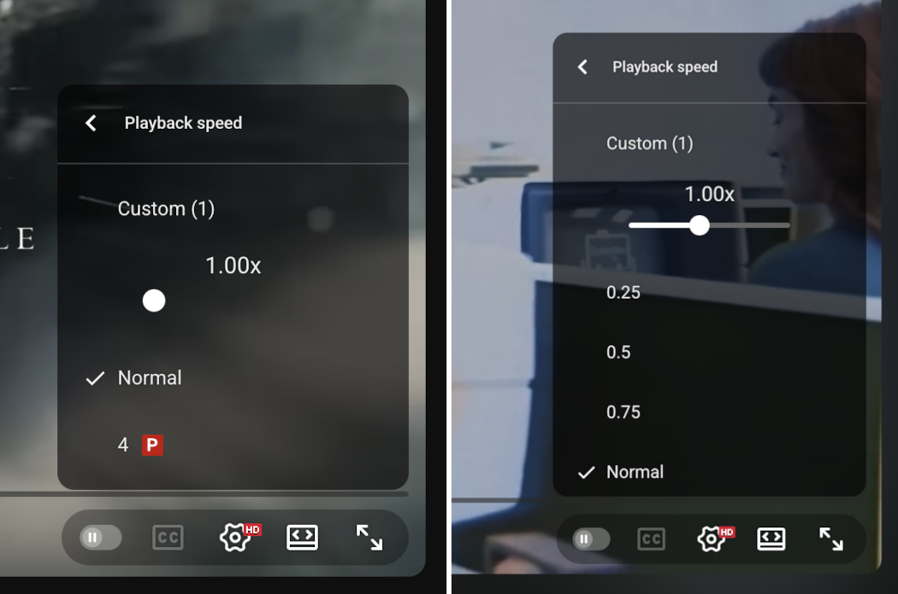
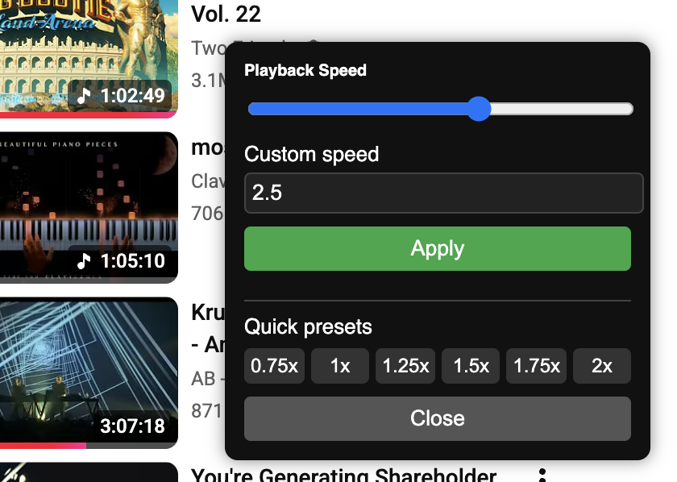
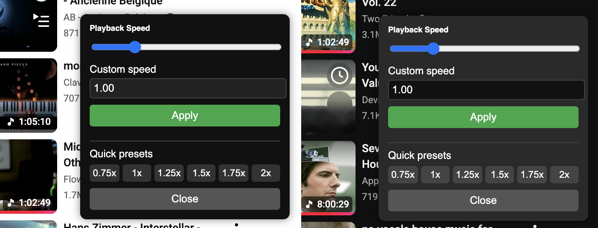
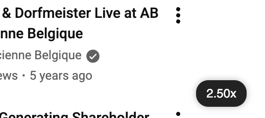
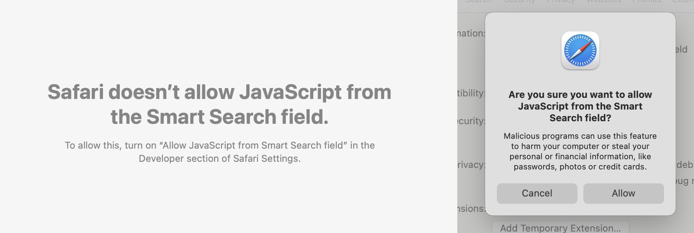

# YouTube Playback Speed Bookmarklet

A lightweight bookmarklet that enables full playback-speed control on YouTube.

This repository contains:

* [A full, expanded version](bookmarklet.js) of the bookmarklet (readable and documented)
* [A minified production version](bookmarklet.min.js) suitable for direct use as a bookmarklet


## Why Is This Helpful?

Recently, YouTube's playback-speed UI has become inconsistent. Some videos show the full speed menu (0.25x → 2x). Some show the menu with "1x" as the only option.


<p><em>YouTube's playback-speed menu sometimes appears, sometimes doesn't.</em></p>

The underlying video element still supports speed changes. It's as simple as opening the terminal, and entering:
```
document.getElementsByTagName("video")[0].playbackRate = 2
```

Nice and easy! But who wants to crack open the terminal every time they want to speed up or slow down a video? This repo provides a bookmarklet which adds a simple UI layer to manage the speed.


## Features

* Persistent speed across YouTube navigation (SPA-friendly)
* Floating indicator of current speed
* Light & dark mode support
* No extension required — pure JavaScript


## Screenshots

<p><em>Custom playback speed settings.</em></p>
<br /><br />


<p><em>Dark mode automatically detected.</em></p>
<br /><br />


<p><em>Floating pill shows the active speed.</em></p>


# Installation

### 1. Create a new bookmark

In Chrome, Safari, Firefox or Edge:

* Right-click the bookmarks bar
* "Add page…" / "Add bookmark…"

### 2. Paste the bookmarklet code into the URL field

Copy the contents of [bookmarklet.min.js](bookmarklet.min.js) into the address field.

Save it, and you're ready to go! Click that bookmark on any YouTube page, and controls should appear.

# Full Code (Readable Version)

The full expanded version is available for reference at [bookmarklet.js](bookmarklet.js). This version is easier to study, modify, or extend - including UI code, MutationObserver hooks, Safari positioning tweaks, and dark-mode detection.

Things like comments in the file will stop the bookmarklet from working, so be sure to copy in the `bookmarklet.min.js` version to avoid problems.


# How It Works

### 1. Apply Speed to the Video Element

```javascript
function r() {
  const v = document.querySelector("video");
  if (!v) return;
  if (window.ytSpeedSaved > 0) v.playbackRate = window.ytSpeedSaved;
}
```

### 2. Persist Across YouTube's SPA Navigation

YouTube is a single-page app, so navigating between videos doesn't reload the browser page.
We use a `MutationObserver` to detect when a new `<video>` element appears:

```javascript
window.ytSpeedObserver = new MutationObserver(r);
window.ytSpeedObserver.observe(document.body, {
  childList: true,
  subtree: true,
});
```

### 3. Automatic Dark Mode Detection

```javascript
const d = document.documentElement.hasAttribute("dark");
...
pill.style.background = d ? "#eee" : "#222";
pill.style.color = d ? "#000" : "#fff";
```


# Safari Notes

Safari has some additional security restrictions around bookmarklets, so you'll need to enable the "Allow JavaScript from the Smart Search field" option in Safari's Developer Settings menu.



To do this, first enable the Develop menu by going to Developer -> Developer Settings, and checking "Allow Javscript from Smart Search field". This will allow the bookmarklet to run properly in Safari.

# Further Reading

The full write-up - including screenshots, explanations, and a detailed walkthrough - is available here:

🔗 [How to Change YouTube Playback Speed with a Simple Bookmarklet](https://www.conroyp.com/articles/how-to-change-youtube-playback-speed-with-a-simple-bookmarklet)


# Feedback & Contributions

Issues, suggestions, and pull requests are welcome.

Open an issue here:
[https://github.com/conroyp/youtube-playback-speed-bookmarklet/issues](https://github.com/conroyp/youtube-playback-speed-bookmarklet/issues)


# License

MIT
Do whatever you like.
